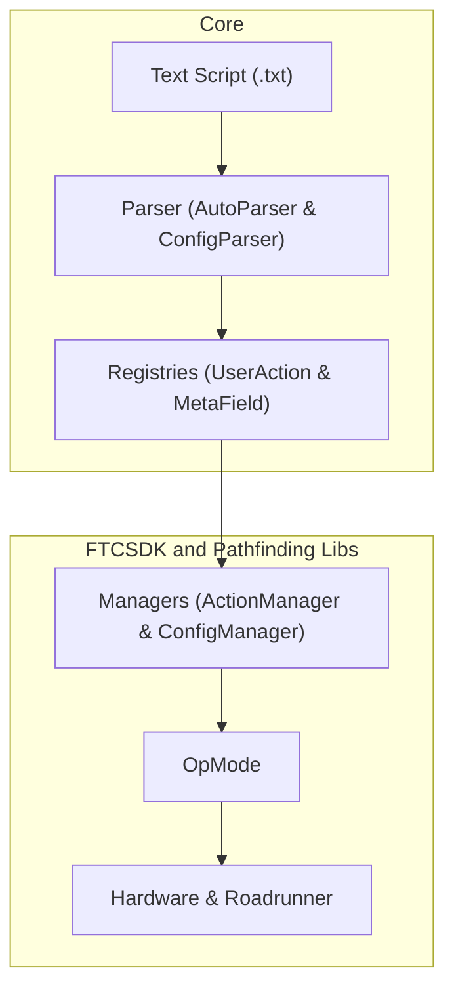

# Developer Guide

The Developer Guide covers the internal architecture of Instant Auto and how to contribute to the project.

*   [Introduction](index.md)
*   [Action & Config Parser](parser.md)
*   [Action System & UserActionRegistry](action-system.md)
*   [Configuration & MetaFieldRegistry](configuration.md)
*   [Execution](execution.md)
*   [Contributing](contributing.md)

# Instant Auto Framework

Instant Auto is a high-level, text-based autonomous framework for FTC robots, built on top of [Roadrunner 1.0](https://rr.brott.dev/docs/v1-0/introduction/). It allows teams to write and iterate on autonomous paths using simple text files without needing to recompile code for every change.

## Core Concepts

The framework bridges the gap between high-level path descriptions and low-level hardware control through a modular registry-based architecture.

### How it Works

1.  **Text Scripts**: Autonomous routines are defined in plain text files (e.g., `testAuto.txt`).
2.  **Parser**: An interpreter (`AutoParser` & `ConfigParser`) that reads the text file and resolves strings into functional components.
3.  **Action & Config Registry**: Centralized stores (`UserActionRegistry` and `MetaFieldRegistry`) that define the "vocabulary" of the robot—what it knows and what it can do.
4.  **Action/Config Manager**: Java-side classes (`ActionManager` and `ConfigManager`) that bind hardware-specific logic (like Roadrunner drive commands or servo movements) to the registries.
5.  **Autonomous/TeleOp Application**: The final `OpMode` that uses the parser to generate and execute an action sequence.

## System Architecture

The following flowchart illustrates the lifecycle of an Instant Auto routine, from the text script to hardware execution:

